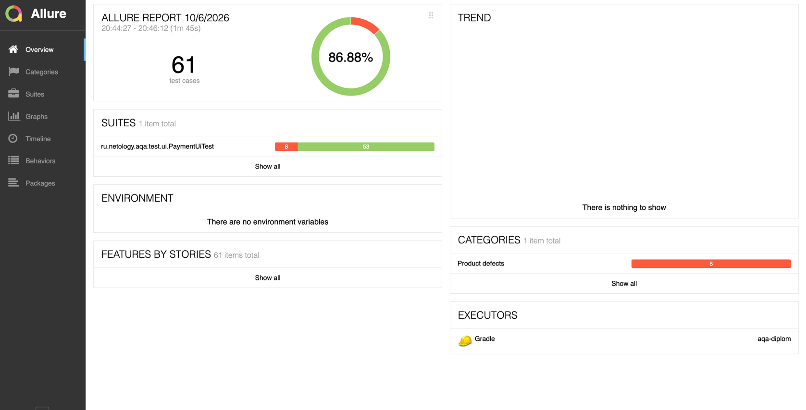
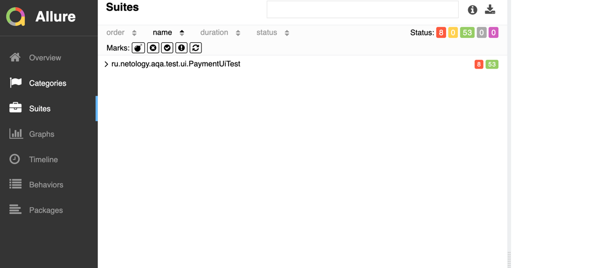

# Отчёт о проведённой автоматизации

## 1. Цель автоматизации

В рамках дипломного проекта была выполнена автоматизация тестирования веб-приложения `aqa-shop.jar`.

На этапе планирования были предусмотрены проверки двух форм приложения:

* «Купить»;
* «Купить в кредит».

Для автоматизации была выбрана форма **«Купить»**. Форма «Купить в кредит» была включена и проверена в рамках ручного
тестирования.

Цель автоматизации — создать набор UI-автотестов, позволяющий повторно проверять основные пользовательские сценарии,
валидацию формы и корректность сохранения результатов операций в базе данных.

## 2. Что было запланировано

В рамках автоматизации планировалось:

* подготовить тестовые данные для APPROVED- и DECLINED-карт;
* реализовать UI-тесты формы «Купить»;
* проверить обязательные поля формы;
* проверить валидацию номера карты, месяца, года, владельца и CVC/CVV;
* проверить граничные и некорректные значения;
* проверить обработку букв, специальных символов и пробелов;
* проверить успешную оплату APPROVED-картой;
* проверить обработку DECLINED-карты;
* проверить результаты операций в базе данных;
* проверить поведение формы после первоначальной ошибки валидации;
* настроить запуск тестов через Gradle;
* подключить Allure для формирования отчёта о результатах автоматизации.

## 3. Что реализовано

В рамках проекта реализованы:

* тестовые данные и методы генерации данных;
* UI-автотесты формы «Купить»;
* проверки валидации полей;
* проверки граничных и некорректных значений;
* проверки специальных символов, букв и пробелов;
* проверки APPROVED-операции;
* проверки результата операции в базе данных;
* SQL-запросы для проверки данных в БД;
* запуск автотестов средствами Gradle;
* формирование HTML-отчёта Gradle;
* интеграция с Allure.

Для реализации автотестов использовались:

* **JUnit 5**;
* **Selenide**;
* **Gradle**;
* **JDBC / SQLHelper**;
* **MySQL**;
* **Allure**.

## 4. Результаты автоматизированного тестирования

Всего выполнен **62 автоматизированный тест-кейс**.

| Результат | Количество |  Процент |
|-----------|-----------:|---------:|
| PASS      |         53 |   86,89% |
| FAIL      |          8 |   13,11% |
| **Всего** |     **61** | **100%** |

Неуспешные автотесты связаны с дефектами приложения.

### Allure Report

### Тест-кейсы, выявившие дефекты

| Тест-кейс | Результат | Выявленная проблема                                                                                                                  |
|-----------|-----------|--------------------------------------------------------------------------------------------------------------------------------------|
| AUT-02    | FAIL      | Для DECLINED-карты операция корректно отклоняется в UI, однако ожидаемая запись со статусом `DECLINED` в БД отсутствует.             |
| AUT-21b   | FAIL      | Поле «Владелец» принимает значение из одного символа, хотя по требованиям оно должно быть отклонено                                  |
| AUT-22a   | FAIL      | Некорректная обработка кириллических символов в поле «Владелец».                                                                     |
| AUT-23b   | FAIL      | Цифры в поле «Владелец» принимаются приложением вместо удаления и отображения ошибки обязательного заполнения.                       |
| AUT-24a   | FAIL      | Специальные символы с буквами в поле «Владелец» принимаются приложением.                                                             |
| AUT-24b   | FAIL      | Значение, состоящее только из специальных символов, принимается приложением вместо очистки поля и отображения ошибки.                |
| AUT-29b   | FAIL      | При пустом CVC/CVV дополнительно отображается ошибка у корректно заполненного поля «Владелец».                                       |
| AUT-31    | FAIL      | После корректного заполнения формы сообщения об ошибках не снимаются. Ошибки остаются у полей «Номер карты», «Владелец» и «CVC/CVV». |

## 5. Сопоставление ручного тестирования и автоматизации

В рамках ручного тестирования были проверены обе формы приложения:

* «Купить» — 14 тест-кейсов;
* «Купить в кредит» — 14 тест-кейсов.

Всего выполнено **28 ручных тест-кейсов**:

* PASS — 21;
* FAIL — 7;
* PASS — 75%;
* FAIL — 25%.

Автоматизация была выполнена только для формы **«Купить»** и включила **62 автоматизированный тест-кейс**:

* PASS — 53;
* FAIL — 8;
* PASS — 86,89%;
* FAIL — 13,11%.

Количество ручных тест-кейсов и автоматизированных тестов не сопоставимые показатели. Один ручной сценарий может быть
раскрыт в нескольких автотестах, проверяющих отдельные варианты входных данных и поведения формы.

## 6. Что не было реализовано

Автоматизация формы **«Купить в кредит»** не выполнялась.

Данная форма была предусмотрена в плане тестирования и проверена вручную, однако не вошла в итоговую автоматизацию.

Причина: для выполнения основной задачи требование - автоматизация одной формы.

## 7. Выявленные риски

В процессе выполнения проекта сработали следующие риски.

### Риск 1. Конфликт порта MySQL

Порт `3306`, используемый MySQL по умолчанию, оказался занят. Для подключения контейнера MySQL был выбран порт `3307`.

Потребовалась корректировка конфигурации подключения тестов к базе данных.

### Риск 2. Настройка запуска приложения

Для запуска приложения потребовалась настройка URL сервисов банковских шлюзов.

### Риск 3. Несоответствие результата операции UI и БД

В процессе тестирования были обнаружены сценарии, в которых результат операции в пользовательском интерфейсе не
соответствует ожидаемому состоянию базы данных.

Поэтому при автоматизации использовались не только UI-проверки, но и проверки данных в БД.

### Риск 4. Зависимость валидности тестовых данных от текущей даты

При проверке срока действия карты использование фиксированного года и месяца может привести к устареванию тестовых
данных.

Для валидных сценариев используются динамически формируемые значения года и месяца.

## 8. Результаты и отчётность

Тесты запускаются средствами **Gradle**.

По результатам выполнения 61 автоматизированного теста получено:

* 51 PASS;
* 10 FAIL.

Результаты выполнения доступны в стандартном HTML-отчёте Gradle.

Также настроена интеграция с **Allure**, позволяющая сформировать расширенный отчёт о выполнении автоматизированных
тестов.

## 9. Общий итог по времени

| Этап                           | Планируемое время | Фактическое время |
|--------------------------------|------------------:|------------------:|
| Подготовка окружения           |                 1 |                 3 |
| Подготовка тест-плана          |                 3 |                10 |
| Ручное тестирование            |                 2 |                 3 |
| Реализация автотестов          |              8-10 |                17 |
| Настройка проверок БД          |               2-3 |                 5 |
| Настройка Gradle и Allure      |               1-2 |                 1 |
| Подготовка отчётных документов |               1-2 |                 5 |
| **Итого**                      |            **23** |            **41** |

Расхождения объясняется дополнительным временем, затраченным на настройку окружения, настройку запуска приложения,
реализацию проверок БД и отладку автотестов, написание отчетов.

## 10. Итог

В рамках проекта был подготовлен план тестирования двух форм приложения и проведено ручное тестирование обеих форм.

Автоматизирован выбранный объём — форма **«Купить»**. Реализован набор из **61 автоматизированного теста**, из которых
51 завершился успешно и 10 завершились с ошибкой.

Автоматизированный набор включает UI-проверки, проверки валидации и проверки результатов операций в базе данных.

По результатам автоматизированного тестирования выявлены дефекты, связанные преимущественно с обработкой данных в поле
«Владелец», повторной валидацией формы, обработкой CVC/CVV и сохранением результата DECLINED-операции в базе данных.

Результаты автоматизации представлены в отчётах Gradle и Allure.
